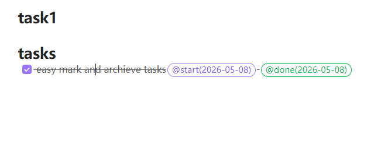
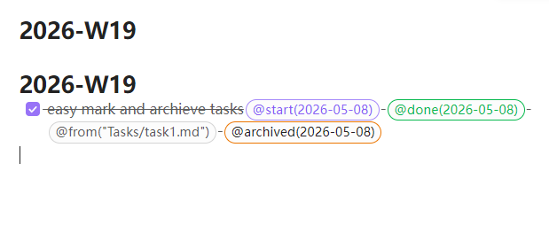

# Task Timestamp Marker

[简体中文说明](./README.zh-CN.md)

Zero-config task tracking for Obsidian.

Task Manager starts working as soon as you enable it:

- Create a task and it appends `@start(YYYY-MM-DD)`.
- Complete a task and it appends `@done(YYYY-MM-DD)`.
- Turn on optional archiving later if you want completed tasks moved into weekly notes.

## Quick Look

### Automatic task markers

Task Manager adds task lifecycle markers directly in your note, so you can see when a task started and when it was completed without extra setup.

### Marker workflow video

The demo below shows the basic flow: create a task, check it off, and let the plugin append the correct markers automatically.

<video src="./assets/media/task-marker.mp4" controls muted playsinline></video>

## What It Does

- Tracks task start dates automatically.
- Tracks task completion dates automatically.
- Works out of the box with no folder setup required.
- Can optionally archive completed tasks into `year / month / week` files.

### Archive output

When you enable archiving or trigger it manually, completed tasks are moved into archive notes so the working page stays clean.

