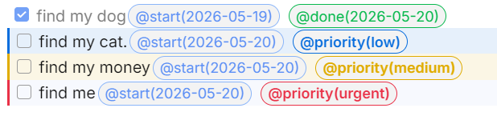
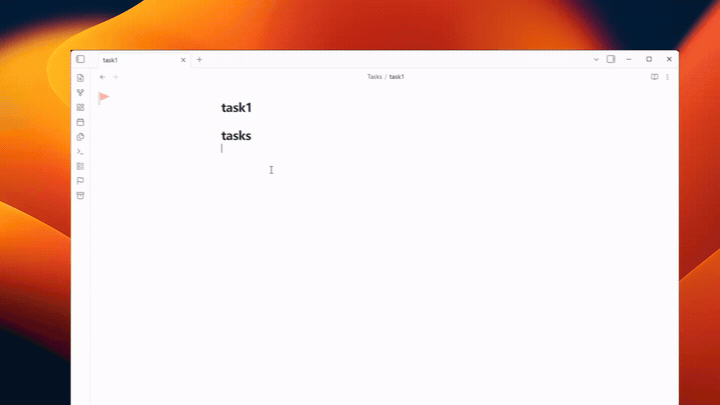
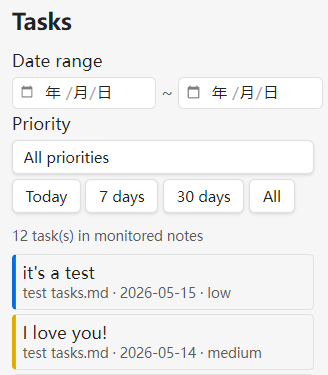

# Task Timestamp Marker

<strong>一款用于 Obsidian 桌面端的任务管理插件：自动补全任务时间戳、优先级、跨笔记筛选，并将已完成任务保存为 SQLite 结构化数据。</strong>

---

  <a href="https://github.com/gansxx/task_manager/blob/master/README.md">English Docs</a> 

## 演示

创建任务、勾选完成，然后由插件自动补上对应的时间标记。

---

## 快速开始
启用后即可直接工作（**零配置**）：

- 新建任务时，插件会自动追加 `@start(YYYY-MM-DD)`。
- 完成任务时，插件会自动追加 `@done(YYYY-MM-DD)`。
- **右键菜单** 可为任务添加 `@priority(urgent|high|medium|low)` 优先级标记，并通过命令进行管理。
---

## 使用建议
- 打开 **Task Manager** 侧边栏，可以按日期区间、优先级和文件路径筛选监听范围内的任务，并将常用路径收藏到下拉框中快速复用。

---
- 已完成任务保留在原笔记并带有 `@done(...)` 标记；结构化记录保存到 `.obsidian/plugins/task-timestamp-marker/completed-tasks.sqlite`，供分析视图与后续单独分析使用。
---

<strong>如果这个插件对你有帮助，欢迎点个 Star！</strong>

